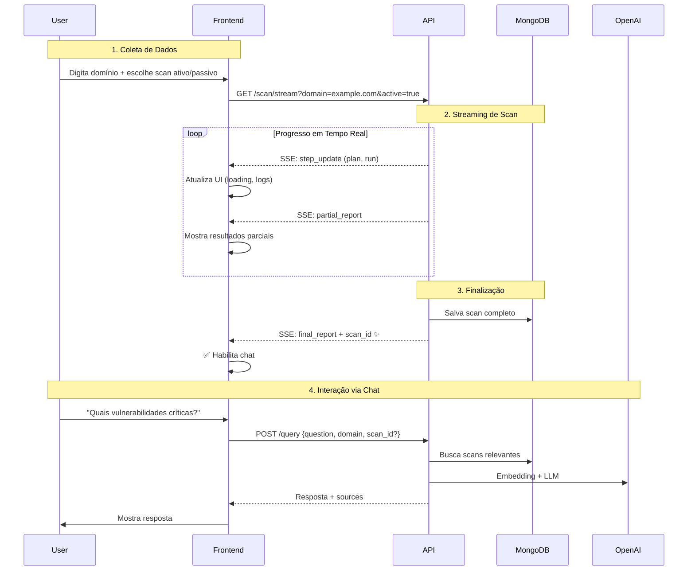

# 🔄 Fluxo da API: Do Scan às Perguntas

## Visão Geral

Fluxo completo para frontend que:
1. Pergunta domínio + tipo de scan ao usuário
2. Mostra progresso em tempo real (streaming)
3. Quando finalizar, libera chat para perguntas

---

## 📋 Fluxo Completo



---

## 🎯 Endpoints Necessários

### 1. Iniciar Scan (Streaming)

```javascript
GET /scan/stream?domain={domain}&active={true|false}
```

**Headers:**
```
Accept: text/event-stream
```

**Response (SSE Events):**

```javascript
// Evento 1: Planejamento
data: {
  "type": "step_update",
  "step": "plan",
  "timestamp": "2026-02-08T23:00:00",
  "details": {
    "current_plan": ["whois", "dnsdumpster", "nmap"],
    "remaining": 3
  }
}

// Evento 2: Execução (múltiplos)
data: {
  "type": "step_update",
  "step": "run",
  "timestamp": "2026-02-08T23:00:05",
  "details": {
    "last_tool": "whois",
    "completed_count": 1
  }
}

// Evento 3: Resultado Parcial
data: {
  "type": "partial_report",
  "step": "run",
  "timestamp": "2026-02-08T23:00:05",
  "details": {
    "tool": "whois",
    "analysis": "Domínio registrado em 2020..."
  }
}

// Evento 4: Policy Decisions (se houver)
data: {
  "type": "policy_decision",
  "step": "run",
  "timestamp": "2026-02-08T23:00:10",
  "details": {
    "decisions": [...],
    "tools_added": ["nuclei", "nikto"]
  }
}

// Evento FINAL: ✨ Agora inclui scan_id!
data: {
  "type": "final_report",
  "step": "report",
  "timestamp": "2026-02-08T23:05:00",
  "scan_id": "scan_20260208_230000_a1b2c3",  // ✨ NOVO!
  "domain": "example.com",
  "details": {
    "final_report": "...",
    "summary": "...",
    "analysis_log": [...]
  }
}

// Evento de Fechamento
event: close
data: {}
```

### 2. Fazer Perguntas (Chat)

```javascript
POST /query
Content-Type: application/json

{
  "question": "Quais vulnerabilidades críticas foram encontradas?",
  "domain": "example.com",        // Opcional: filtra por domínio
  "max_scans": 3                  // Opcional: máximo de scans no contexto
}
```

**Response:**
```json
{
  "answer": "Foram encontradas 3 vulnerabilidades críticas...",
  "sources": [
    {
      "scan_id": "scan_20260208_230000_a1b2c3",
      "domain": "example.com",
      "timestamp": "2026-02-08T23:00:00",
      "similarity": 0.92
    }
  ],
  "confidence": 0.92,
  "question": "Quais vulnerabilidades críticas foram encontradas?",
  "processing_time_ms": 1234.56
}
```

---

## 💻 Implementação Frontend (React)

### Componente Completo

```typescript
import React, { useState, useEffect } from 'react';

interface ScanState {
  status: 'idle' | 'scanning' | 'completed' | 'error';
  scan_id?: string;
  domain?: string;
  events: any[];
  progress: number;
}

interface Message {
  role: 'user' | 'assistant';
  content: string;
  sources?: any[];
}

export function ScanAndChatInterface() {
  // Estado do Scan
  const [scanState, setScanState] = useState<ScanState>({
    status: 'idle',
    events: [],
    progress: 0
  });
  
  // Estado do Chat
  const [messages, setMessages] = useState<Message[]>([]);
  const [question, setQuestion] = useState('');
  const [isAsking, setIsAsking] = useState(false);
  
  // Formulário de Scan
  const [domain, setDomain] = useState('');
  const [activeScan, setActiveScan] = useState(false);

  // ============================================================
  // 1. INICIAR SCAN
  // ============================================================
  const startScan = async () => {
    setScanState({
      status: 'scanning',
      domain,
      events: [],
      progress: 0
    });
    
    const eventSource = new EventSource(
      `http://localhost:8000/scan/stream?domain=${domain}&active=${activeScan}`
    );
    
    eventSource.onmessage = (event) => {
      const data = JSON.parse(event.data);
      
      setScanState(prev => ({
        ...prev,
        events: [...prev.events, data],
        progress: calculateProgress(data, prev.events)
      }));
      
      // ✨ Detecta finalização com scan_id
      if (data.type === 'final_report' && data.scan_id) {
        setScanState(prev => ({
          ...prev,
          status: 'completed',
          scan_id: data.scan_id,
          progress: 100
        }));
        eventSource.close();
        
        // Mensagem inicial do chat
        setMessages([{
          role: 'assistant',
          content: `✅ Scan de ${domain} concluído! Você pode fazer perguntas sobre os resultados.`
        }]);
      }
    };
    
    eventSource.addEventListener('close', () => {
      eventSource.close();
    });
    
    eventSource.onerror = (error) => {
      console.error('SSE Error:', error);
      setScanState(prev => ({ ...prev, status: 'error' }));
      eventSource.close();
    };
  };

  // ============================================================
  // 2. FAZER PERGUNTAS (CHAT)
  // ============================================================
  const askQuestion = async () => {
    if (!question.trim() || isAsking) return;
    
    // Adiciona pergunta do usuário
    const userMessage: Message = { role: 'user', content: question };
    setMessages(prev => [...prev, userMessage]);
    setQuestion('');
    setIsAsking(true);
    
    try {
      const response = await fetch('http://localhost:8000/query', {
        method: 'POST',
        headers: { 'Content-Type': 'application/json' },
        body: JSON.stringify({
          question: userMessage.content,
          domain: scanState.domain,  // Filtra pelo domínio scaneado
          max_scans: 3
        })
      });
      
      if (!response.ok) throw new Error('Query failed');
      
      const data = await response.json();
      
      // Adiciona resposta do assistente
      const assistantMessage: Message = {
        role: 'assistant',
        content: data.answer,
        sources: data.sources
      };
      setMessages(prev => [...prev, assistantMessage]);
      
    } catch (error) {
      console.error('Query error:', error);
      setMessages(prev => [...prev, {
        role: 'assistant',
        content: '❌ Erro ao processar pergunta. Tente novamente.'
      }]);
    } finally {
      setIsAsking(false);
    }
  };

  // ============================================================
  // UI RENDER
  // ============================================================
  return (
    <div className="scan-chat-interface">
      {/* FASE 1: FORMULÁRIO DE SCAN */}
      {scanState.status === 'idle' && (
        <div className="scan-form">
          <h2>Iniciar Scan</h2>
          <input
            type="text"
            placeholder="Domínio (ex: example.com)"
            value={domain}
            onChange={(e) => setDomain(e.target.value)}
          />
          <label>
            <input
              type="checkbox"
              checked={activeScan}
              onChange={(e) => setActiveScan(e.target.checked)}
            />
            Scan Ativo (Nmap, Nuclei, etc.)
          </label>
          <button onClick={startScan} disabled={!domain}>
            🚀 Iniciar Scan
          </button>
        </div>
      )}
      
      {/* FASE 2: PROGRESSO DO SCAN */}
      {scanState.status === 'scanning' && (
        <div className="scan-progress">
          <h2>Scanning {scanState.domain}...</h2>
          <div className="progress-bar">
            <div style={{ width: `${scanState.progress}%` }} />
          </div>
          <div className="scan-events">
            {scanState.events.map((event, i) => (
              <div key={i} className={`event event-${event.type}`}>
                <span className="event-type">{event.type}</span>
                <span className="event-details">
                  {JSON.stringify(event.details, null, 2)}
                </span>
              </div>
            ))}
          </div>
        </div>
      )}
      
      {/* FASE 3: CHAT (APÓS SCAN) */}
      {scanState.status === 'completed' && (
        <div className="chat-interface">
          <div className="scan-summary">
            <span>✅ Scan ID: {scanState.scan_id}</span>
            <span>Domain: {scanState.domain}</span>
            <button onClick={() => setScanState({ status: 'idle', events: [], progress: 0 })}>
              🔄 Novo Scan
            </button>
          </div>
          
          <div className="messages">
            {messages.map((msg, i) => (
              <div key={i} className={`message message-${msg.role}`}>
                <div className="message-content">{msg.content}</div>
                {msg.sources && (
                  <div className="message-sources">
                    <strong>Fontes:</strong>
                    {msg.sources.map((src, j) => (
                      <div key={j} className="source">
                        📄 {src.scan_id} - {src.domain} 
                        (similaridade: {(src.similarity * 100).toFixed(1)}%)
                      </div>
                    ))}
                  </div>
                )}
              </div>
            ))}
            {isAsking && <div className="message-loading">Processando...</div>}
          </div>
          
          <div className="chat-input">
            <input
              type="text"
              placeholder="Faça uma pergunta sobre o scan..."
              value={question}
              onChange={(e) => setQuestion(e.target.value)}
              onKeyPress={(e) => e.key === 'Enter' && askQuestion()}
              disabled={isAsking}
            />
            <button onClick={askQuestion} disabled={isAsking || !question.trim()}>
              {isAsking ? '⏳' : '📤'} Enviar
            </button>
          </div>
        </div>
      )}
    </div>
  );
}

// Função auxiliar para calcular progresso
function calculateProgress(latestEvent: any, allEvents: any[]): number {
  if (latestEvent.type === 'final_report') return 100;
  if (latestEvent.type === 'step_update' && latestEvent.step === 'report') return 90;
  if (latestEvent.type === 'step_update' && latestEvent.step === 'run') {
    const details = latestEvent.details;
    if (details?.completed_count) {
      // Estimativa: run é 80% do trabalho
      return Math.min(80, details.completed_count * 10);
    }
    return 50;
  }
  if (latestEvent.type === 'step_update' && latestEvent.step === 'plan') return 10;
  return 0;
}
```

### CSS Básico

```css
.scan-chat-interface {
  max-width: 800px;
  margin: 0 auto;
  padding: 20px;
}

.scan-form {
  background: #f5f5f5;
  padding: 20px;
  border-radius: 8px;
}

.scan-form input[type="text"] {
  width: 100%;
  padding: 10px;
  margin: 10px 0;
  border: 1px solid #ddd;
  border-radius: 4px;
}

.scan-form button {
  width: 100%;
  padding: 12px;
  background: #007bff;
  color: white;
  border: none;
  border-radius: 4px;
  cursor: pointer;
  font-size: 16px;
}

.scan-form button:disabled {
  background: #ccc;
  cursor: not-allowed;
}

.scan-progress {
  background: #fff;
  padding: 20px;
  border-radius: 8px;
  box-shadow: 0 2px 4px rgba(0,0,0,0.1);
}

.progress-bar {
  height: 20px;
  background: #f0f0f0;
  border-radius: 10px;
  overflow: hidden;
  margin: 20px 0;
}

.progress-bar div {
  height: 100%;
  background: linear-gradient(90deg, #007bff, #0056b3);
  transition: width 0.3s ease;
}

.scan-events {
  max-height: 400px;
  overflow-y: auto;
  margin-top: 20px;
}

.event {
  padding: 10px;
  margin: 5px 0;
  border-left: 3px solid #007bff;
  background: #f9f9f9;
}

.event-type {
  font-weight: bold;
  color: #007bff;
}

.chat-interface {
  background: #fff;
  border-radius: 8px;
  box-shadow: 0 2px 4px rgba(0,0,0,0.1);
}

.scan-summary {
  padding: 15px;
  background: #e8f5e9;
  border-bottom: 1px solid #ddd;
  display: flex;
  justify-content: space-between;
  align-items: center;
}

.messages {
  height: 400px;
  overflow-y: auto;
  padding: 20px;
}

.message {
  margin: 15px 0;
  padding: 10px 15px;
  border-radius: 8px;
  max-width: 80%;
}

.message-user {
  background: #007bff;
  color: white;
  margin-left: auto;
}

.message-assistant {
  background: #f0f0f0;
  color: #333;
}

.message-sources {
  margin-top: 10px;
  padding-top: 10px;
  border-top: 1px solid rgba(0,0,0,0.1);
  font-size: 0.9em;
}

.source {
  padding: 5px 0;
  color: #666;
}

.chat-input {
  display: flex;
  padding: 15px;
  border-top: 1px solid #ddd;
  gap: 10px;
}

.chat-input input {
  flex: 1;
  padding: 10px;
  border: 1px solid #ddd;
  border-radius: 4px;
}

.chat-input button {
  padding: 10px 20px;
  background: #007bff;
  color: white;
  border: none;
  border-radius: 4px;
  cursor: pointer;
}

.chat-input button:disabled {
  background: #ccc;
  cursor: not-allowed;
}

.message-loading {
  text-align: center;
  color: #999;
  font-style: italic;
}
```

---

## 🧪 Testes

```bash
# 1. Valide que scan_id é retornado
curl -N http://localhost:8000/scan/stream?domain=example.com

# Último evento deve conter "scan_id"

# 2. Teste query com domain filter
curl -X POST http://localhost:8000/query \
  -H "Content-Type: application/json" \
  -d '{
    "question": "Quais vulnerabilidades?",
    "domain": "example.com"
  }'
```

---

## 📊 Diagrama de Estados

```
[IDLE]
  │
  │ Usuário digita domínio + tipo scan
  ↓
[SCANNING] ──────┐
  │              │ Cliente cancela
  │ Streaming    │ ou erro
  │ em tempo     │
  │ real         ↓
  ↓          [ERROR]
[COMPLETED]
  │              
  │ scan_id salvo
  │ Chat habilitado
  ↓
[READY_FOR_CHAT]
  │
  │ Loop: perguntas e respostas
  ↓
```

---

## 🎯 Resumo do Fluxo

1. **Input**: Usuário fornece `domain` + escolhe `active scan` (checkbox)

2. **Scan**: 
   - Connect SSE: `/scan/stream?domain=X&active=Y`
   - Mostra progresso em tempo real
   - Aguarda evento `final_report` com `scan_id`

3. **Chat Habilitado**:
   - Mostra `scan_id` e resumo
   - Habilita input de pergunta
   - POST `/query` com `question` + `domain` (opcional)
   - Mostra resposta + sources

4. **Novo Scan**:
   - Botão para resetar e fazer novo scan
   - Mantém histórico de chats (opcional)

---

## 🚀 Próximos Passos

- [ ] Deploy frontend com este fluxo
- [ ] Adicionar persistência de chat (histórico de perguntas)
- [ ] Streaming de respostas do LLM (resposta token-por-token)
- [ ] Múltiplos scans em paralelo (tabs)
- [ ] Comparação entre scans (diff)
